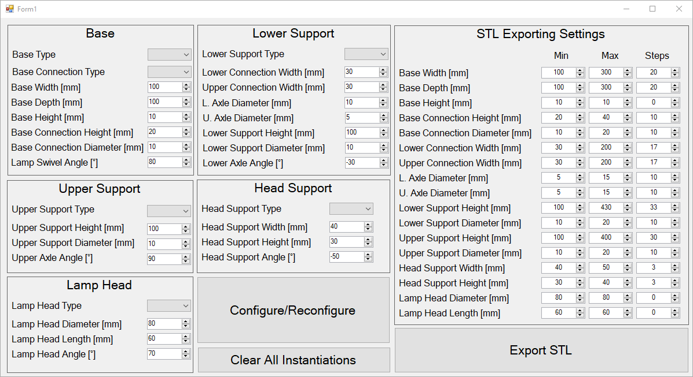
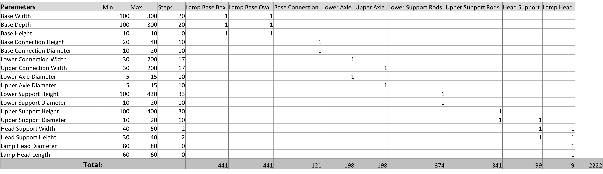
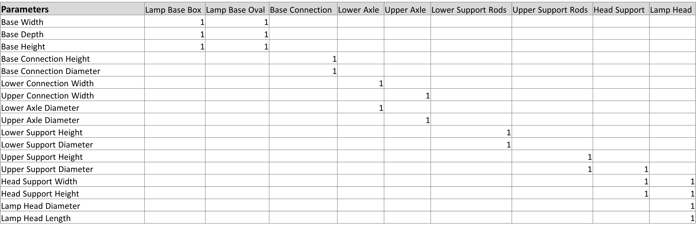
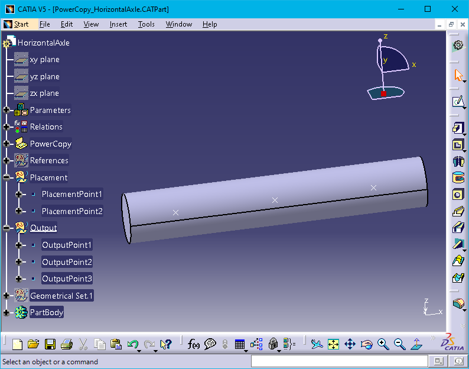

# CATIA Product Configurator

Welcome to the CATIA Product Configurator repo! This CATIA product configurator is based on the methods taught in the product modeling course at LiU ([TMKT57](https://studieinfo.liu.se/en/kurs/TMKT57/vt-2022)). It is developed for the [Design Automation Lab](https://liu.se/en/research/design-automation-lab) at the division of product realisation at Linköping University as part of my master thesis.

This is an example repo for how to implement a product configurator and STL exporter in CATIA. The STLs produced by this repo is intended to be utilized in the implementation of a product configurator in WebGL according to the [webgl-product-configurator repo](https://github.com/patrikdolsson/webgl-product-configurator). This repo can be used as a template to implement your own product configurator and STL exporter for any other customizable product. The product configurator is created using a windows forms application in Visual Studio connected to the [CATIA API](https://catiadesign.org/_doc/V5Automation/) using COM-referenences. 

A [startup guide](#getting-started), a [preview](#preview), an [explanation of how the product configurator works](#how-does-it-work) and a [brief step by step guide to implement your own product configurator](#how-to-implement-your-own-product-configurator) will follow.

Keep in mind that the example is purely for illustrative purposes of the functionality of this approach. Realism of the product is not the aim of this repo.

## Getting started

How to run the example:

-   Download/clone this repo to a folder on your machine, or import this repo to your own repo and clone that repo
-   Unzip the CATIA files and place it somewhere on your local machine
-   Open the project solution in Visual Studio
-   Open FileLocation.xml and replace the paths to corresponding desired locations on your local machine (Note: The STL and temp paths do not have to exist)
-   Open TableLamp.CATProduct in CATIA and make sure you are in the assembly design workbench.
-   Run the solution and test the product configurator

## Preview

The windows forms app should look like the following:

The resulting product in CATIA should look something like the following when configured:

## How does it work?

The configurator uses abstracted [power copies](http://catiadoc.free.fr/online/pktug_C2/pktugat0053.htm) to instantiate parts in desired context. The entire product is defined in code by fully defining the instantiation of all the parts in terms of the configuration parameters. All context references are hard coded as defined by the power copies. 

The parameters that affect the geometry of components of the product will need to be discretized when exporting the STL models for use in the [webgl implementation](https://github.com/patrikdolsson/webgl-product-configurator). This discretization of parameters and determining of STL models that are exported using the export STL button is done by using what I call a PPCM (Part Permutation Calculation Matrix) as shown in the following figure:

The setup of part of this matrix is done as self-evident in windows forms application as shown in the [preview](#preview). The totals on the bottom row is the number of configurations of each instantiated component as according to the discretization of the parameters. The numbers of configurations for each component are calculated using the following formula:

$$\text{Permutations of a component} = \prod_{i=1}^{n}\left(p_{i,s} + 1\right)$$

where,

-   $n$ = the number of geometry affecting parameters
-   $p_{i,s}$ = the number of uniform discretized steps that the parameter $p_i$ can take inside its interval

The PPCM is derived from what I call a GAPASM (Geometry-Affecting Parameter Associative Structure Matrix), which is a matrix that intends to show which parameters affect the geometry of what components. An example of this is shown in the following figure:

The actual configurations are calculated using recursive functions in order to calculate all the different configurations no matter how many parameters are involved. 

Furthermore, the configuration of the GUI control in the [webgl implementation](https://github.com/patrikdolsson/webgl-product-configurator) is almost fully determined by the stlInfo.json file produced by this repo. Which parameters that should be available for change in the webgl implementation is determined by the explicit setup of the STL export in the module [ExportSTL.vb](https://github.com/patrikdolsson/CATIA-product-configurator/blob/main/CATIA%20Product%20Configurator/CATIA%20Product%20Configurator/ExportSTL.vb).

## How to implement your own product configurator

The current implementation is quite narrow in the product structure that is compatible with it. The product structure that will work with this implementation is defined as the following:

-   The product structure is completely flat. Meaning that the product will consist of a list of instantiated power copies as their own parts.
-   Each instantiated power copy may have alternative versions (or types) that can be replaced in the same or different context. However, one power copy may only replace one other power copy. One power copy may not be replaced by two or more other power copies; and one power copy may not replace two or more other power copies.
-   If a component has alternative power copy versions. Switches between the versions may not induce the switch of other components' power copy versions.
-   If higher levels of modularization is desired, nested use of power copies may be implemented in order to create power copies of different types that represent higher levels of sub-components.

On top of this, dynamic number of instantiations of power copies based on configuration parameters is not handled in a general way by this repo. It is not difficult to get the CATIA product to behave as intended. The problem arises when trying to figure out the PPCM and export the STL models in an intended way to get the [webgl implementation](https://github.com/patrikdolsson/webgl-product-configurator) to work as intended. This is especially true when separate instances of power copies should receive their own set of equivalent parameters. Substantial changes to this repo and the webgl implementation may be needed to get it to work as intended.

Given that the product you're trying to implement is compatible with this repo, the following step by step guide should be enough to help you implement your own product configurator that exports STL models for a webgl implementation using this repo.

### Step 1

Add "Placement Points" and "Output Points" to all of your power copies you intend to use. The placement points should represent points on the part geometry that you can place in relation to a global coordinate in the webgl implementation. The output points should represent points on the part geometry that you intend to use to calculate global coordinates for use when placing another component to the product. In essence, placement points are placed on other component's outpoints.

Placement points should be placed inside a geometrical set named "Placement" and output points should be placed inside a geometrical set named "Output" as done in the following image:

### Step 2

Determine all of your configuration parameters and change the Form1 display to fit your configurator. 

Study Button1's and Button2's event handler functions in Form1.vb and implement your versions to fit your implementation

### Step 3

Open ConfigureFunctions.vb and change the GetAcceptableTypes to fit your product. Review the functions: Configure, ModifyAngles, ModifyReferenceParameters and determine if you need the same or similar setup of functions and implement it to fit your implementation.

Then review and change the ConfigureParts function to fit your implementation.

Then review the InstantiateLampBase functions with its comments to understand how each power copy is instantiated and how references are applied. Then implement it to fit all of your parts.

### Step 4

Open ExportSTL.vb and review the function GetPartsToExport and change necessary parts to fit your implementation.

### Step 5

Study Button3's event handler function in Form1.vb and change it to fit your implementation

### Step 6

You should now be able to run the "Export STL" button and use the resulting STL folder in a [webgl implementation](https://github.com/patrikdolsson/webgl-product-configurator).